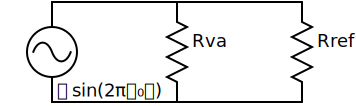
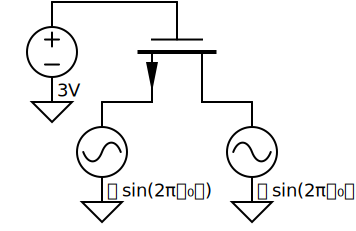
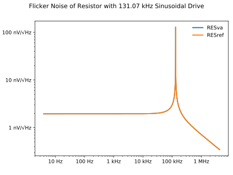
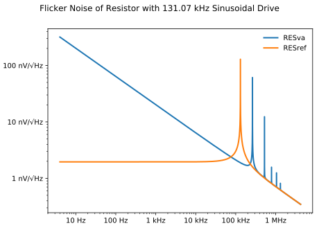
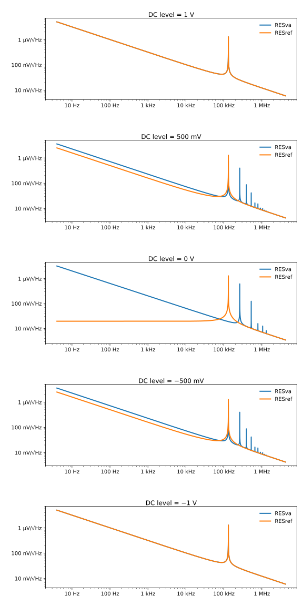
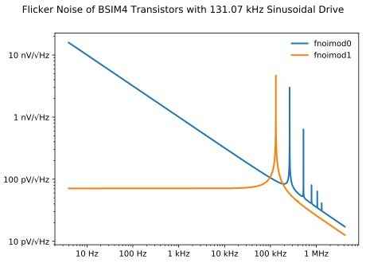

Flicker Noise Formulations in Compact Models
============================================

:Author: Geoffrey Coram, Colin McAndrew, Kiran Gullapalli and Ken Kundert
:Version: 1.2.0
:Released: 2020-11-13

Includes a resistor model that demonstrates how to properly model flicker noise 
in Verilog-A as described in:

| `Flicker Noise Formulations in Compact Models <https://kenkundert.com/docs/tcad20-flicker-noise.pdf>`_;
| G. J. Coram, C. C. McAndrew, K. K. Gullapalli, and K. S. Kundert;
| IEEE Transactions on CAD, vol. 39, no. 10, October 2020.

Also included are two circuits. The first is a simple test circuit for the 
resistor model.  Here Rva is the Verilog-A model and Rref is the resistor model 
that is built-in to Spectre.

The second is a circuit that tests the implementation of flicker noise in the 
built-in BSIM4 model.

If you have a recent version of Spectre, you can simulate the circuits directly 
and view the results in your favorite waveform viewer.

If you have Python 3.6 or later, you can also run the simulation scripts, which
re-generate the netlists, run the simulations (in Spectre), and plot the 
results.

To install the script dependencies, from the directory that contains setup.py,
run::

   pip3 install --user .

This installs all dependencies into ~/.local/lib.  Then simply run::

   ./runPnoise

or::

   ./runBSIM

These run a simulation and plot the results. You have the -v option and the 
logfile (.runPnoise.log or .runBSIM.log) to help you out if you run into any 
problems.

You can also run a simulation of the broken resistor model::

  ./runPnoise --broken

You can view the signal and waveforms with::

   > list-psf -f pnoise.raw/pnoise.pnoise -l
   > show-psf out

My rather old version of Spectre (15.1.0) generated the following results:

Resistor
--------

The above shows the flicker noise produced by Spectre's built-in resistor 
(*RESref*) and the proposed Verilog-A model (*RESva*). In this case the flicker 
noise of the built-in resistor model was implemented correctly and both agree.

Flicker noise in a resistor is a variation or a flickering in the value of the 
resistance over time. The variation has a *1/f* power spectrum and is completely 
bias independent; it is not affected by the applied signal at all.  You can 
observe the flickering by applying a DC bias voltage to the resistor.  The 
result will be a noise in the current with a *1/f* spectrum.  In this circuit we 
instead apply a sinusoidal voltage with a frequency of 131kHz and no DC 
component to observe the flickering.  This results in the same *1/f* 
characteristic in the noise, but now mixed up to 131kHz as shown in the figure.

Broken Resistor
---------------

The above shows the flicker noise produced by Spectre's built-in resistor 
(*RESref*) and the traditional Verilog-A model (*RESva*). In this case the 
flicker noise of the Verilog-A model is incorrect and the two models 
disagree.

In this case the simulator discards the sign of the sinusoid when performing the 
noise calculation. As such, it appears to the resistor that the applied test 
signal is not a pure tone sinusoid, but rather a fully rectified sinusoid. So 
rather than have a single spectral component at 131kHz, it has components at 
each of the even harmonics of 131kHz, meaning it has components at DC, and 
262kHz, 524kHz, etc.  The result is that the *1/f* spectrum from the flicker 
noise is replicated and shifted up by each harmonic, meaning that there are 
peaks at each of the harmonics of the rectified sine wave.  The peaks are 
equally spaced in frequency, but they appear to be getting closer together at 
higher frequencies because the *x*-axis uses logarithmic scaling.

This problem is further illustrated in the graphs below. In this case both the 
built-in resistor and the broken version of the Verilog-A resistor are driven 
with a 1Vp sinusoid where the DC offset is swept from 1V to –1V. In the first 
and last graphs, the offset is 1V and –1V, so the current through the resistors 
never change sign.  They are either always positive or always negative. In these 
cases, discarding of the sign is of no consequence and the noise computed for 
the two resistors agree.  There is a peak at *f* = 0 because of the DC component 
of the modulation signal, and a peak at *f* = *f₀*, which is the drive 
frequency.  In the results for the 0 V offset, the built-in resistor only shows 
a peak at *f₀*, the drive frequency, whereas the broken resistor shows peaks at 
each of the even harmonics of the drive signal because the sign of the drive 
signal is lost.

BSIM
----

The above shows two different flicker noise models implemented in the built-in 
BSIM4 model in Spectre.  *fnoimod=1* was implemented correctly while *fnoimod=0* 
was not.

A good first order model for flicker noise in MOSFETs is a bias independent 
variation in the threshold voltage.  This variation tends to modulate the 
current passing through the channel. If the channel current is DC you end up 
with simple *1/f* noise. However, if the channel current is sinusoidal, the 
flicker noise is up-converted to the frequency of the sinuosoid, as seen with 
*fnoimod* = 1.  However, the implementation of *fnoimod* = 0 discards the sign 
of the sinusoid when doing the noise calculation, and so we again see peaks at 
each of the even harmonics of the test signal.
